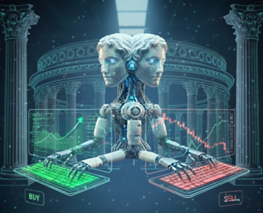
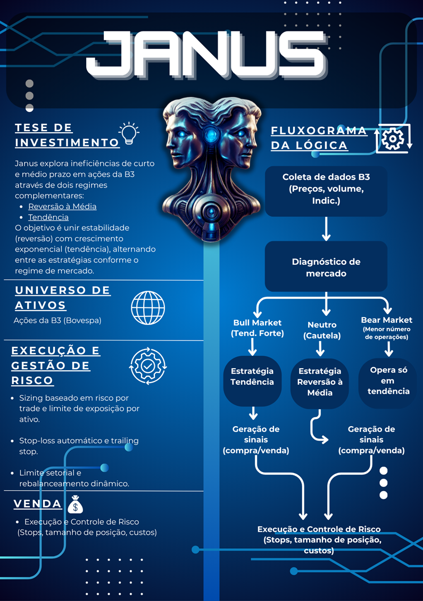
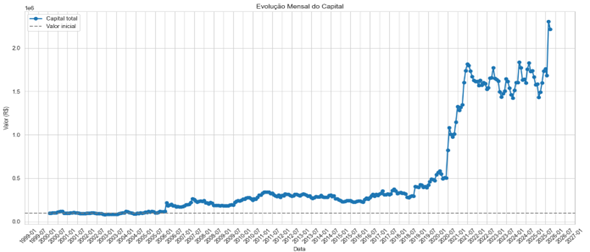
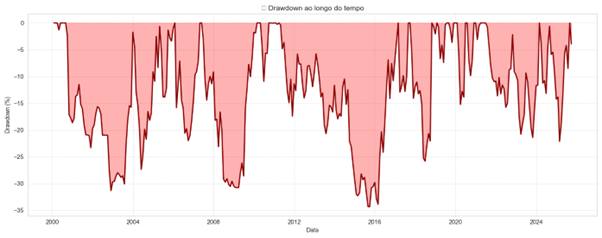

# Janus: Dual Strategy – Relatório Final Desafio Quant-AI Itaú 2025

## 🤖 Sobre o Janus
O **Janus** é um robô de investimentos focado em ações da B3 (Universo IBrA). O nome é uma homenagem ao deus romano das transições, Jano, que possui duas faces. Essa dualidade reflete a arquitetura do modelo: uma "face" observa a tendência macro (passado recente), enquanto a outra aguarda o momento tático de entrada (recuo de curto prazo).

O projeto foi desenvolvido como um modelo quantitativo adaptativo que busca superar as limitações de estratégias monométricas através do conceito de **Regime Switching**.

---

## 📈 Tese de Investimento
A estratégia, denominada **Dual Strategy**, aloca capital dinamicamente baseando-se em dois regimes complementares:

* **Trend Following (TEND):** Busca capturar grandes movimentos e crescimento exponencial.
* **Reversão à Média (REV):** Otimiza o ponto de entrada através de recuos temporários em cenários de sobrevenda ou sobrecompra.

### Fluxograma da Lógica

---

## 🛠️ Funcionamento Técnico
O modelo utiliza um **Filtro de Tendência Macro** (baseado na porcentagem de ativos acima de suas médias de longo prazo) para definir o regime de mercado: **Bull, Bear ou Neutro**.

* **Seleção de Ativos:** Filtros estritos excluem papéis com preço abaixo de R$ 5,00 e com alta volatilidade relativa (ATR/Preço > 5%)[cite: 18].
* **Sistema de Scoring:** A decisão de compra ocorre quando o ativo excede um Score Mínimo baseado em indicadores como ADX, PDI/MDI (para tendência) e Keltner Channels/RSI (para reversão).
* **Frequência:** Diária, utilizando o benchmark IBOV.

---

## 🛡️ Gestão de Risco
O gerenciamento de risco é calibrado individualmente por estratégia usando o **ATR (Average True Range)**:

| Estratégia | Risco Máximo (Capital Total) | Regra de Saída |
| :--- | :--- | :--- |
| **Tendência (TEND)** | 1.5% | Trailing Stop Móvel (2.5x ATR)  |
| **Reversão (REV)** | 0.3% | Alvo Fixo (3x Risco) ou Keltner Superior |

---

## 📊 Resultados e Performance
Os testes abrangeram um período de **25.8 anos**, comprovando a capacidade de gerar **Alpha** com risco controlado.

### Métricas Consolidadas (2000 - 2025)
* **Retorno Anual Médio (CAGR):** 12.68% 
* **Retorno Total:** 2066.63% 
* **Máximo Drawdown:** -38.74% (significativamente menor que o Ibovespa histórico) 
* **Profit Factor:** 1.49x 
* **Ratio Lucro/Prejuízo:** 2.86x 

---

## 🧠 Desenvolvimento e IA
O projeto utilizou ferramentas de IA Generativa (**ChatGPT, Claude e Gemini**) como apoio técnico:
* Depuração e otimização de código Python[cite: 41].
* Calibragem de parâmetros (scores e métricas de risco) e análise de sensibilidade no backtest.
* Criação de identidade visual e auxílio na estruturação do relatório.

> **Nota:** Todas as respostas geradas por IA foram submetidas à análise crítica e supervisão humana para corrigir inconsistências lógicas ou erros conceituais.

---

## 🚀 Desafios Futuros
* Otimização da performance em regimes de mercado lateral/neutro, onde o Profit Factor tende a cair.
* Implementação de filtros por setores para aumentar a resiliência e diversificação da carteira.

---
*Este projeto foi desenvolvido para o Desafio Quant-AI Itaú 2025.* 
